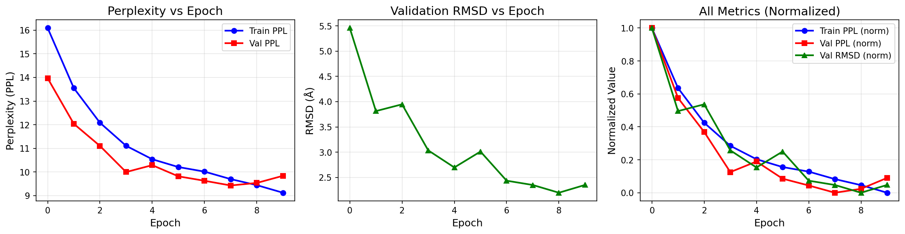

# Antigen-Aware CDR Structure Prediction with Cross-Attention Graph Neural Networks

[](LICENSE)
[](https://www.python.org/downloads/)
[](https://pytorch.org/)

This repository contains the code for the **Stanford CS224W (Machine Learning with Graphs)** final project exploring antigen-aware antibody CDR structure prediction using cross-attention mechanisms integrated into RefineGNN.

## Overview

Antibodies recognize pathogens through their Complementarity-Determining Regions (CDRs). This project extends the [RefineGNN](https://arxiv.org/abs/2110.04624) model by incorporating antigen structural information via cross-attention, hypothesizing that explicit antigen features would improve CDR structure prediction.

**Key Finding:** Contrary to expectations, antigen conditioning did not improve CDR structure prediction—and in some cases slightly degraded performance. This suggests that when training on bound-state antibody-antigen complexes, the antibody structure alone contains sufficient information to predict CDR conformations.

## Project Structure

```
cs224w_final_project/
├── structgen/                     # Core model implementation
├── data/                          # Dataset files (train/val/test splits)
├── ckpts/
│   └── antigen_aware/             # Model checkpoints
├── plots/                         # Training curves and visualizations
├── predictions/                   # Inference outputs
├── test/                          # Test scripts
│
├── ab_train.py                    # Original RefineGNN training script
├── ab_train_with_antigen.py       # Antigen-aware training script
├── ab_train_with_antigen_final.py # Final training script with logging
├── baseline_train.py              # Baseline model training
├── inference.py                   # Run inference on test samples
├── visualize.py                   # Structure visualization utilities
├── visualize_cdr.py               # Visualize predicted CDR structures
├── plot_from_checkpoints.py       # Generate training curves from checkpoints
├── print_cdr.py                   # Print CDR sequences
├── covid_optimize.py              # COVID antibody optimization
├── fold_train.py                  # Fold-based training
├── seq_train.py                   # Sequence-based training
├── rabd_test.py                   # RosettaAntibodyDesign benchmark test
├── neut_model.py                  # Neutralization predictor model
│
├── 5dsc_chothia.pdb               # Example PDB files
├── 7d5p_chothia.pdb
├── 7d5q_chothia.pdb
├── pdb_comparison.txt             # PDB comparison results
├── training_curves_with_antigen.png
├── LICENSE
└── README.md
```

## Installation

### Prerequisites

- Python 3.8+
- PyTorch 1.9+
- CUDA (optional, for GPU acceleration)

### Setup

```bash
# Clone the repository
git clone https://github.com/simone-surdi/cs224w_final_project.git
cd cs224w_final_project

# Create virtual environment (recommended)
python -m venv venv
source venv/bin/activate  # On Windows: venv\Scripts\activate

# Install dependencies
pip install torch torchvision torchaudio
pip install numpy pandas matplotlib tqdm
pip install biopython  # For PDB file handling
```

## Dataset

The dataset is derived from the **Structural Antibody Database (SAbDab)**, containing antibody-antigen complexes with complete CDR annotations.

| CDR Type | Training | Validation | Test | Total |
|----------|----------|------------|------|-------|
| CDR-H1   | ~2,600   | ~380       | ~280 | ~3,260 |
| CDR-H2   | ~2,650   | ~390       | ~290 | ~3,330 |
| CDR-H3   | ~2,700   | ~270       | ~295 | ~3,265 |

## Usage

### Training

**Train antigen-aware model (CDR-H1):**
```bash
python ab_train_with_antigen_final.py \
    --train_path data/sabdab/hcdr1_cluster/train_data_with_antigen_unique.jsonl \
    --val_path data/sabdab/hcdr1_cluster/val_data_with_antigen_unique.jsonl \
    --test_path data/sabdab/hcdr1_cluster/test_data_with_antigen_unique.jsonl \
    --save_dir ckpts/antigen_aware/cdr_type_1 \
    --cdr_type 1 \
    --epochs 10
```

**Train antigen-aware model (CDR-H3):**
```bash
python ab_train_with_antigen_final.py \
    --train_path data/sabdab/hcdr3_cluster/train_data_with_antigen_unique.jsonl \
    --val_path data/sabdab/hcdr3_cluster/val_data_with_antigen_unique.jsonl \
    --test_path data/sabdab/hcdr3_cluster/test_data_with_antigen_unique.jsonl \
    --save_dir ckpts/antigen_aware/cdr_type_3 \
    --cdr_type 3 \
    --epochs 10
```

### Inference

```bash
python inference.py \
    --checkpoint ckpts/antigen_aware/cdr_type_3/model.best.ckpt \
    --test_path data/sabdab/hcdr3_cluster/test_data_with_antigen_unique.jsonl \
    --save_dir predictions/
```

### Visualization

```bash
python visualize_cdr.py \
    --pred_pdb predictions/sample_pred.pdb \
    --true_pdb predictions/sample_true.pdb \
    --output plots/comparison.png
```

## Results

### Quantitative Results

| Model | CDR | Val PPL | Val RMSD (Å) | Test PPL | Test RMSD (Å) |
|-------|-----|---------|--------------|----------|---------------|
| No Antigen | H1 | 7.878 | 1.367 | 6.994 | 1.012 |
| With Antigen | H1 | 7.773 | 1.339 | 6.966 | 1.077 |
| No Antigen | H2 | 7.309 | 0.911 | 7.293 | 1.113 |
| With Antigen | H2 | 7.506 | 1.085 | 7.592 | 1.102 |
| No Antigen | H3 | 9.283 | 2.135 | 9.301 | 2.310 |
| With Antigen | H3 | 9.348 | 2.214 | 9.417 | 2.330 |

### Effect of Antigen Conditioning

| CDR | No Antigen (Val RMSD) | With Antigen (Val RMSD) | Change |
|-----|----------------------|------------------------|--------|
| H1 | 1.367 Å | 1.339 Å | -2.1% |
| H2 | 0.911 Å | 1.085 Å | +19.1% |
| H3 | 2.135 Å | 2.214 Å | +3.7% |

### Training Curves



## Key Insights

1. **Bound-state prediction works well without antigen**: The baseline RefineGNN achieves 0.9-2.1Å RMSD without explicit antigen information
2. **Implicit encoding**: The antibody framework already encodes binding interface information
3. **Negative results are informative**: Simply adding cross-attention to antigen features does not help

## References

- [RefineGNN Paper (Jin et al., ICLR 2022)](https://arxiv.org/abs/2110.04624)
- [SAbDab: Structural Antibody Database](http://opig.stats.ox.ac.uk/webapps/newsabdab/sabdab/)
- [Previous CS224W Project](https://medium.com/@ssyoung_58002/bc7c2c55c016)

## Citation

```bibtex
@misc{surdi2024antigencdr,
  title={Antigen-Aware CDR Structure Prediction with Cross-Attention Graph Neural Networks},
  author={Surdi, Simone},
  year={2024},
  note={Stanford CS224W Final Project}
}
```

## License

This project is licensed under the MIT License - see the [LICENSE](LICENSE) file for details.

## Acknowledgements

- Stanford CS224W course staff
- Sonny Young and Kif Lim for the previous project foundation
- RefineGNN authors for the base implementation
- SAbDab database maintainers
## Acknowledgements

- Stanford CS224W course staff
- Sonny Young and Kif Lim for the previous project foundation
- RefineGNN authors for the base implementation
- SAbDab database maintainers
